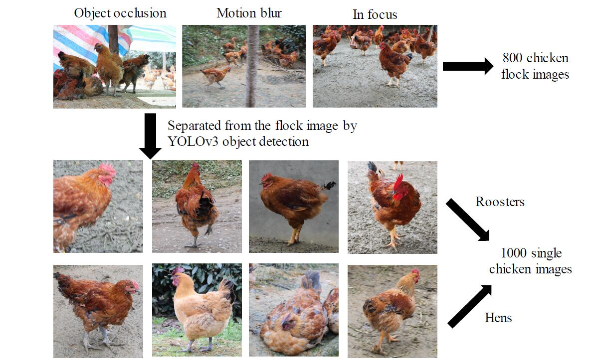
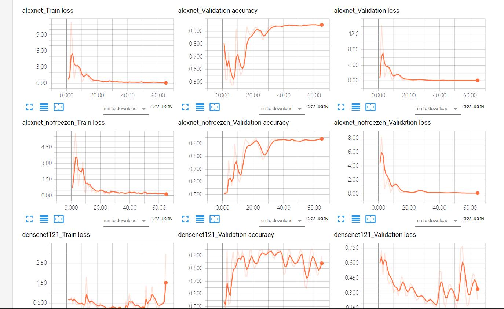
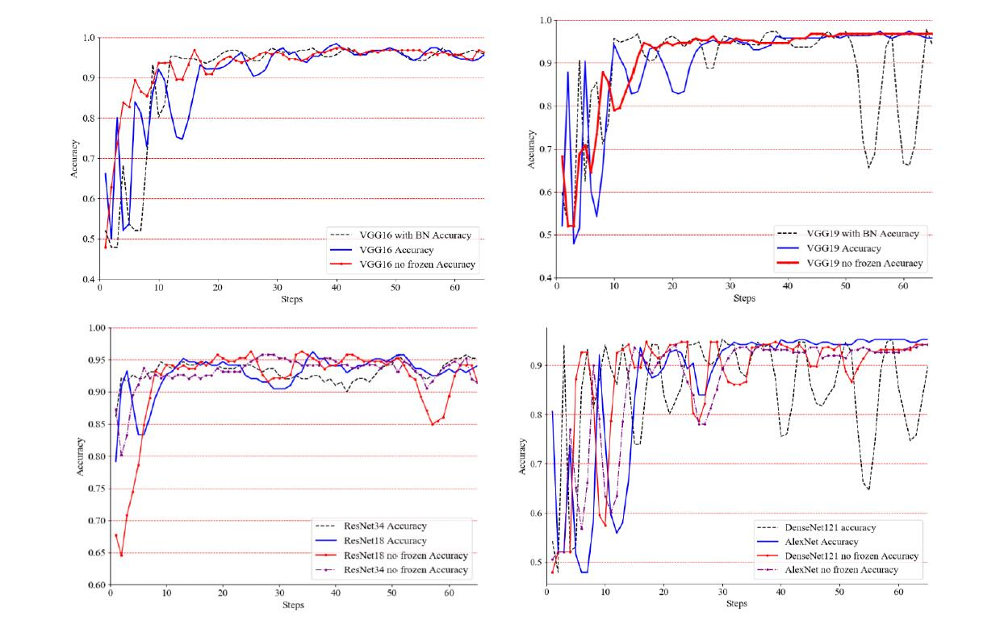

# A classifier with PyTorch

**This code calls the models in Torchvision, and the classification network topic framework is derived from Torchvision.**
**(And if you have any problem,you can send email to me:1904272yao@gmail.com or leave an error message in Issues.**
```python
from .alexnet import *
from .resnet import *
from .vgg import *
from .squeezenet import *
from .inception import *
from .densenet import *
from .googlenet import *
from .mobilenet import *
from .mnasnet import *
from .shufflenetv2 import *
from . import segmentation
from . import detection
from . import video
```
 
```python
#Several classification frameworks are available
AlexNet、densenet121、densenet169、densenet201、densenet161、GoogLeNet、Inception3、mnasnet0_5、mnasnet0_75、mnasnet1_0、mnasnet1_3、MobileNetV2、resnet18、resnet34、resnet50、resnet101、resnet152、resnext50_32x4d、resnext101_32x8d、wide_resnet50_2、wide_resnet101_2、vgg11、vgg13、vgg16、vgg19、vgg11_bn、vgg13_bn、vgg16_bn、vgg19_bn...........
```
*The above is the classic network framework available within the models, and only for the classification networks within.This code is can take transfer learning , download the ImageNet pre trained initial model and then transfer learning  in your code, and can be frozen convolution training only full connection layer, or global training, we only use the convolution of the classic network layer, and then the convolution results set on our lightweight classifier，*


## Train on our datasets
We used this classifier to predict the gender of the chicken, and we used vgg16,vgg16_bn,vgg19,vgg19_bn,resnet18,resnet34、densenet101 made a comparison。You can get our dataset [here](https://drive.google.com/open?id=1eGq8dWGL0I3rW2B9eJ_casH0_D3x7R73 "dataset")(谷歌云盘，所以大陆用户需翻墙访问，如不能翻墙，或有需要可发邮件给我)

**Some sample images from Our dataset:**
 

## Train on Custom Dataset
```
-your datasets
 |--train
 |   |--label_1
 |   |--label_2
 |   |--label_n
 |--test or Val
     |--label_1
     |--label_2
     |--label_n
```
Your data set needs to look like the file structure above.And if you're not dichotomous, change the last output dimension from 2 to n。
 **Then execute the following command**
 
 `python train.py --data_directory=your dataset --arch=vgg16`
 
 **if you want to train on resnet or densenet and other, you can change the --arch=vgg16 to --arch=resnet34 or -- arch=densenet101 or other**
## Visualization of Training Process
Use tensorboard for visualization. After training, you can enter the following command for visualization.

**Then visit the page that pops up on the command line,the following image will appear**

`tensorboard --logdirs=logs`



**Visit the above page and download the corresponding CSV, then plot the training process according to csv_plot.py：**

**You can adjust the parameters to make the training process more beautiful**
